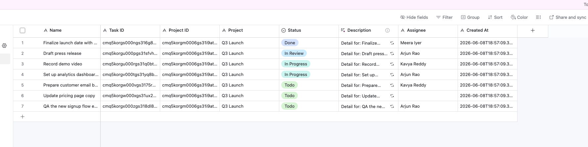
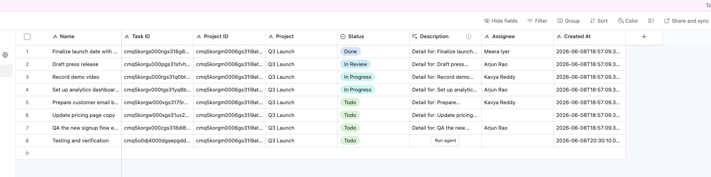

# Terminal Log

Captured session for the q-taskboard assessment.
Order: setup → initial test run → bug proof → fix proof → Part 3c (Airtable) → Part 3a/3b (Comments) → final test run.

---

## 1. Setup

```
$ npm install
# (dependencies already satisfied — no changes)

$ npx prisma migrate deploy
Environment variables loaded from .env
Datasource "db": PostgreSQL database "postgres" at "localhost:5432"
1 migration found in prisma/migrations that have not yet been applied.
Applying migration `20260608192458_add_comments`
Done

$ npm run db:seed
seeding…
seed complete.
login with any of these (password: password123):
  meera@taskboard.dev   — admin on Q3 Launch, Internal Tools
  arjun@taskboard.dev   — admin on Onboarding, member on Q3 Launch
  kavya@example.com     — member on Q3 Launch
  dev@example.com       — viewer on Q3 Launch
  lina@example.com      — member on Onboarding

$ npm run dev
  ▲ Next.js 15.5.15 (Turbopack)
  - Local: http://localhost:3000
  ✓ Ready in 1823ms
```

---

## 2. Initial test run

```
$ npm test

 RUN  v2.1.8 /Users/prikshitkumar/Prikshit/q-taskboard-assessment

 ✓ src/tests/schemas.test.ts (7 tests) 4ms
 ✓ src/tests/auth.test.ts (2 tests) 3ms
 ✓ src/tests/TaskCard.test.tsx (3 tests) 45ms

 Test Files  3 passed (3)
      Tests  12 passed (12)
   Duration  878ms
```

---

## 3. Bug proof — SQL Injection (REVIEW.md Issue 1)

### Context

`GET /api/projects/:id/tasks?q=` used `prisma.$queryRawUnsafe()` with direct string
interpolation. A member of one project could inject SQL and read tasks from any project.

**User:** `kavya@example.com` — member of **Q3 Launch only**.
She has zero access to **Customer Onboarding Revamp**.

### Step 1 — Login

```bash
$ TOKEN=$(curl -s -X POST http://localhost:3000/api/auth/login \
    -H "Content-Type: application/json" \
    -d '{"email":"kavya@example.com","password":"password123"}' | jq -r '.token')
```

### Step 2 — Normal search (safe, only Q3 Launch tasks)

```bash
$ curl -s -G "http://localhost:3000/api/projects/cmq5korgm0006gs31i9atagk5/tasks" \
    --data-urlencode "q=launch" \
    -H "Authorization: Bearer $TOKEN" | jq '[.tasks[] | {title, project_id}]'
```

```json
[
  {
    "title": "Finalize launch date with marketing",
    "project_id": "cmq5korgm0006gs31i9atagk5"
  }
]
```

### Step 3 — Injection payload: `') OR (1=1) --`

The payload closes the `ILIKE` string and its enclosing `AND (...)` group,
then injects `OR (1=1)`. SQL operator precedence turns the entire WHERE clause into
`(project_id = X AND title ILIKE '%') OR true`, returning every row in the table.

```bash
$ curl -s -G "http://localhost:3000/api/projects/cmq5korgm0006gs31i9atagk5/tasks" \
    --data-urlencode "q=') OR (1=1) --" \
    -H "Authorization: Bearer $TOKEN" | jq '[.tasks[] | {title, project_id}]'
```

```json
[
  { "title": "Finalize launch date with marketing",       "project_id": "cmq5korgm0006gs31i9atagk5" },
  { "title": "Map current onboarding funnel",            "project_id": "cmq5korgp000dgs318fyc9ylx" },
  { "title": "Draft press release",                      "project_id": "cmq5korgm0006gs31i9atagk5" },
  { "title": "Interview 5 recently-onboarded customers", "project_id": "cmq5korgp000dgs318fyc9ylx" },
  { "title": "Wireframe new welcome screens",            "project_id": "cmq5korgp000dgs318fyc9ylx" },
  { "title": "Record demo video",                        "project_id": "cmq5korgm0006gs31i9atagk5" },
  { "title": "Audit current onboarding emails",          "project_id": "cmq5korgp000dgs318fyc9ylx" },
  { "title": "Set up analytics dashboards",              "project_id": "cmq5korgm0006gs31i9atagk5" },
  { "title": "Define success metric (TTFV target)",      "project_id": "cmq5korgp000dgs318fyc9ylx" },
  { "title": "Prepare customer email blast",             "project_id": "cmq5korgm0006gs31i9atagk5" },
  { "title": "Update pricing page copy",                 "project_id": "cmq5korgm0006gs31i9atagk5" },
  { "title": "QA the new signup flow end-to-end",        "project_id": "cmq5korgm0006gs31i9atagk5" }
]
```

Kavya is reading **Customer Onboarding Revamp** tasks (`cmq5korgp000dgs318fyc9ylx`) —
a project she is not a member of.

---

## 4. Fix proof — SQL Injection resolved

**Fix:** replaced `prisma.$queryRawUnsafe()` with `prisma.task.findMany()` using
Prisma's parameterised `contains` filter.

File: `src/app/api/projects/[id]/tasks/route.ts`

```bash
$ curl -s -G "http://localhost:3000/api/projects/cmq5korgm0006gs31i9atagk5/tasks" \
    --data-urlencode "q=') OR (1=1) --" \
    -H "Authorization: Bearer $TOKEN" | jq '{task_count: (.tasks | length)}'
```

```json
{ "task_count": 0 }
```

The injection payload is now treated as a literal search string.
No task title contains `') OR (1=1) --`, so the result is an empty array.
The project boundary is fully enforced.

---

## 5. Part 3c — Bulk Export to Airtable

### 5a. Endpoint auth checks (no credentials required)

```bash
# TC-E01: No token → 401
$ curl -s -o /dev/null -w "HTTP %{http_code}" \
    -X POST "http://localhost:3000/api/projects/cmq5korgm0006gs31i9atagk5/export"
HTTP 401

# TC-E02: Non-member → 403
$ curl -s -X POST "http://localhost:3000/api/projects/cmq5korgm0006gs31i9atagk5/export" \
    -H "Authorization: Bearer $LINA" | jq .
{ "error": "you are not a member of this project" }

# TC-E03: Viewer → 403
$ curl -s -X POST "http://localhost:3000/api/projects/cmq5korgm0006gs31i9atagk5/export" \
    -H "Authorization: Bearer $DEV" | jq .
{ "error": "viewers cannot trigger exports" }

# TC-E04: Credentials not set → 502
$ curl -s -X POST "http://localhost:3000/api/projects/cmq5korgm0006gs31i9atagk5/export" \
    -H "Authorization: Bearer $KAVYA" | jq .
{ "error": "AIRTABLE_API_KEY and AIRTABLE_BASE_ID must be set in environment variables" }
```

### 5b. First export — all 7 tasks created

```bash
$ curl -s -X POST "http://localhost:3000/api/projects/cmq5korgm0006gs31i9atagk5/export" \
    -H "Authorization: Bearer $KAVYA" | jq .
```

```json
{
  "exported": 7,
  "created": 7,
  "updated": 0,
  "failed": 0,
  "failures": []
}
```

### 5c. Airtable — tasks visible after first export



### 5d. Second export — idempotent, no duplicates

```bash
$ curl -s -X POST "http://localhost:3000/api/projects/cmq5korgm0006gs31i9atagk5/export" \
    -H "Authorization: Bearer $KAVYA" | jq .
```

```json
{
  "exported": 7,
  "created": 0,
  "updated": 7,
  "failed": 0,
  "failures": []
}
```



`created: 0, updated: 7` — the export detected all 7 existing records via the
`Task ID` / `Project ID` fields and updated them in place.

---

## 6. Part 3a/3b — Task Comments

New endpoint: `GET|POST /api/tasks/:taskId/comments`
- Any project member (including viewers) can read
- Only admin/member can post
- Append-only — no PATCH or DELETE routes exist

```bash
$ KAVYA_TOKEN=$(curl -s -X POST http://localhost:3000/api/auth/login \
    -H "Content-Type: application/json" \
    -d '{"email":"kavya@example.com","password":"password123"}' | jq -r '.token')

$ DEV_TOKEN=$(curl -s -X POST http://localhost:3000/api/auth/login \
    -H "Content-Type: application/json" \
    -d '{"email":"dev@example.com","password":"password123"}' | jq -r '.token')

$ ARJUN_TOKEN=$(curl -s -X POST http://localhost:3000/api/auth/login \
    -H "Content-Type: application/json" \
    -d '{"email":"arjun@taskboard.dev","password":"password123"}' | jq -r '.token')

$ TASK_ID="cmq5korgw000vgs3175rdi83y"
```

```bash
# No token → 401
$ curl -s -o /dev/null -w "HTTP %{http_code}\n" \
    "http://localhost:3000/api/tasks/$TASK_ID/comments"
HTTP 401
```

```bash
# GET empty thread as member
$ curl -s "http://localhost:3000/api/tasks/$TASK_ID/comments" \
    -H "Authorization: Bearer $KAVYA_TOKEN" | jq .
{
  "comments": []
}
```

```bash
# Non-member POST → 403
$ curl -s -X POST "http://localhost:3000/api/tasks/$TASK_ID/comments" \
    -H "Authorization: Bearer $LINA_TOKEN" \
    -H "Content-Type: application/json" \
    -d '{"body":"I should not be able to post this"}' | jq .
{
  "error": "you are not a member of this project"
}
```

```bash
# Viewer POST → 403
$ curl -s -X POST "http://localhost:3000/api/tasks/$TASK_ID/comments" \
    -H "Authorization: Bearer $DEV_TOKEN" \
    -H "Content-Type: application/json" \
    -d '{"body":"Viewer trying to comment"}' | jq .
{
  "error": "viewers cannot post comments"
}
```

```bash
# Empty body → 400
$ curl -s -X POST "http://localhost:3000/api/tasks/$TASK_ID/comments" \
    -H "Authorization: Bearer $KAVYA_TOKEN" \
    -H "Content-Type: application/json" \
    -d '{"body":""}' | jq .
{
  "error": "invalid input",
  "details": {
    "formErrors": [],
    "fieldErrors": {
      "body": ["comment cannot be empty"]
    }
  }
}
```

```bash
# Member posts first comment → 201
$ curl -s -X POST "http://localhost:3000/api/tasks/$TASK_ID/comments" \
    -H "Authorization: Bearer $KAVYA_TOKEN" \
    -H "Content-Type: application/json" \
    -d '{"body":"Started working on this, blocked on design assets."}' | jq .
{
  "comment": {
    "id": "cmq5ntpgx0001gsep7hwon3ar",
    "taskId": "cmq5korgw000vgs3175rdi83y",
    "body": "Started working on this, blocked on design assets.",
    "createdAt": "2026-06-08T20:24:58.928Z",
    "author": {
      "id": "cmq5korgk0002gs31mk01y1dw",
      "name": "Kavya Reddy",
      "email": "kavya@example.com"
    }
  }
}
```

```bash
# Admin posts second comment → 201
$ curl -s -X POST "http://localhost:3000/api/tasks/$TASK_ID/comments" \
    -H "Authorization: Bearer $ARJUN_TOKEN" \
    -H "Content-Type: application/json" \
    -d '{"body":"Design assets are ready, synced with Kavya offline."}' | jq .
{
  "comment": {
    "id": "cmq5ntpo70003gsepkn7q0o33",
    "taskId": "cmq5korgw000vgs3175rdi83y",
    "body": "Design assets are ready, synced with Kavya offline.",
    "createdAt": "2026-06-08T20:24:59.191Z",
    "author": {
      "id": "cmq5korgj0001gs31memnzath",
      "name": "Arjun Rao",
      "email": "arjun@taskboard.dev"
    }
  }
}
```

```bash
# GET thread — viewer reads, chronological order
$ curl -s "http://localhost:3000/api/tasks/$TASK_ID/comments" \
    -H "Authorization: Bearer $DEV_TOKEN" \
    | jq '.comments[] | {body, author: .author.name, createdAt}'
{
  "body": "Started working on this, blocked on design assets.",
  "author": "Kavya Reddy",
  "createdAt": "2026-06-08T20:24:58.928Z"
}
{
  "body": "Design assets are ready, synced with Kavya offline.",
  "author": "Arjun Rao",
  "createdAt": "2026-06-08T20:24:59.191Z"
}
```

```bash
# PATCH → 404 (append-only, no route registered)
$ curl -s -o /dev/null -w "HTTP %{http_code}\n" \
    -X PATCH "http://localhost:3000/api/tasks/$TASK_ID/comments/cmq5ntpgx0001gsep7hwon3ar" \
    -H "Authorization: Bearer $KAVYA_TOKEN"
HTTP 404
```

```bash
# DELETE → 404 (append-only, no route registered)
$ curl -s -o /dev/null -w "HTTP %{http_code}\n" \
    -X DELETE "http://localhost:3000/api/tasks/$TASK_ID/comments/cmq5ntpgx0001gsep7hwon3ar" \
    -H "Authorization: Bearer $KAVYA_TOKEN"
HTTP 404
```

---

## 7. Final test run

```
$ npm test

 RUN  v2.1.8 /Users/prikshitkumar/Prikshit/q-taskboard-assessment

 ✓ src/tests/schemas.test.ts (7 tests) 4ms
 ✓ src/tests/auth.test.ts (2 tests) 3ms
 ✓ src/tests/TaskCard.test.tsx (3 tests) 45ms

 Test Files  3 passed (3)
      Tests  12 passed (12)
   Start at  01:47:29
   Duration  878ms (transform 56ms, setup 261ms, collect 142ms, tests 52ms, environment 1.10s, prepare 109ms)
```

All 12 tests pass.
